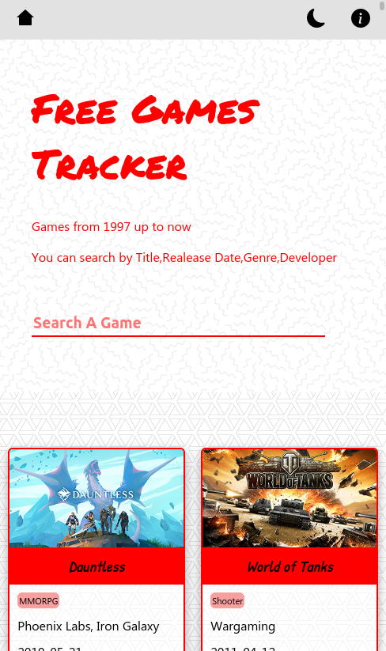
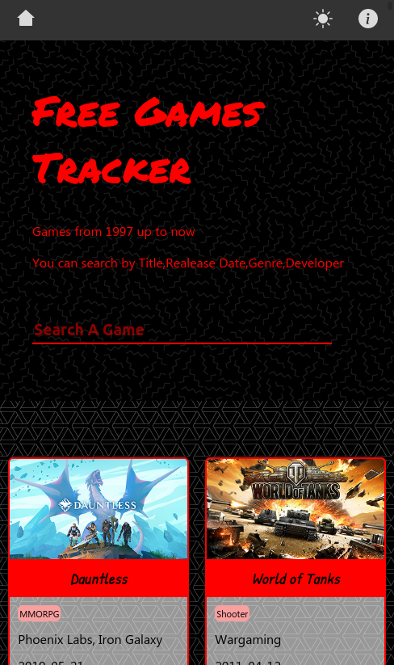

# free-games-tracker
> A web-based application to search for free games, fetching data from the [FreeToGame](https://www.freetogame.com/api-doc) API.

## Live demo
Hosted by Netlify
[Link](https://free-games-tracker.netlify.app/)

## Screenshots
## Light Theme

## Dark Theme

## Demo Video

## Getting Started
Note : 
This project was bootstrapped with [Create React App](https://github.com/facebook/create-react-app), using the [Redux](https://redux.js.org/) and [Redux Toolkit](https://redux-toolkit.js.org/) template. to learn more about `React` visit this links :
* [Create React App documentation](https://facebook.github.io/create-react-app/docs/getting-started).
* To learn React, check out the [React documentation](https://reactjs.org/)
to use this repo please follow this steps : 

### Prerequisite
you need npm to run the commands, if you don't already have it go to this link to install it in your machine [npm](https://docs.npmjs.com/downloading-and-installing-node-js-and-npm)
### Setup

- clone the repo : `https://github.com/benwmx/free-games-tracker`
- create your branch
- run `npm i` to install the node packages.
### Usage
to use this repo and add your suggested changes : 
* Create a new branch
then
* Add your changes

#### Scripts to work with the Project

In the project directory, you can run:

* `npm start`

Runs the app in the development mode. 
Open [http://localhost:3000](http://localhost:3000) to view it in the browser.

The page will reload if you make edits. 
You will also see any lint errors in the console.

* `npm test`

Launches the test runner in the interactive watch mode. 
See the section about [running tests](https://facebook.github.io/create-react-app/docs/running-tests) for more information.

* `npm run build`

Builds the app for production to the `build` folder. 
It correctly bundles React in production mode and optimizes the build for the best performance.

The build is minified and the filenames include the hashes. 
Your app is ready to be deployed!

See the section about [deployment](https://facebook.github.io/create-react-app/docs/deployment) for more information.

## 👤 **Rachid Boudaoudi**

- GitHub: [@benwmx](https://github.com/benwmx)
- Twitter: [@ben_wmx](https://twitter.com/ben_wmx)
- LinkedIn: [Rachid Boudaoudi](https://www.linkedin.com/in/rachid-boudaoudi/)
## Credit

the design is inspired from a template made by Kenyan designer Nelson Sakwa, you can show your support by following him & checkout his other designs in [Behince](https://www.behance.net/sakwadesignstudio)

## 🤝 Contributing

Contributions, issues, and feature requests are welcome!

Feel free to check the [issues page](../../issues/).

## Show your support

Give a ⭐️ if you like this project!

## 📝 License

This project is [MIT](LICENSE) licensed.
